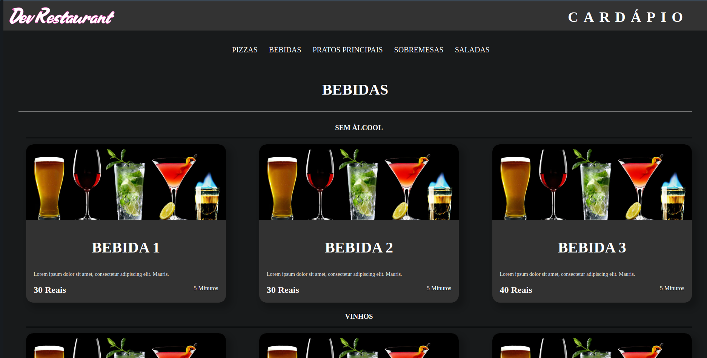
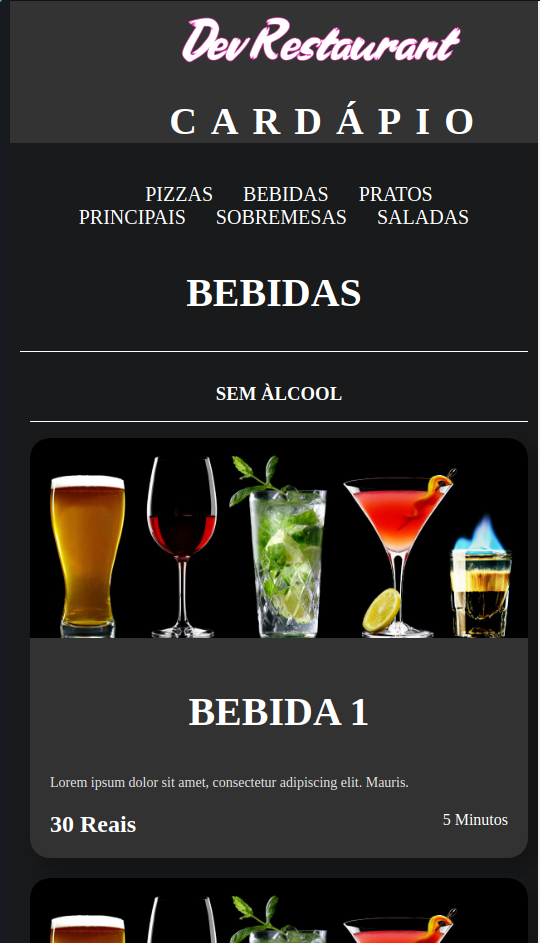

<p align="center"></p>
<br/>
<br/>

<p align="center">
 <h2 align="center">DevRestaurant</h2>
</p>
  <p align="center">
    <a href="">
      
    </a>
    <a href="">
      
    </a>
    <a href="">
      
    </a>        
    <a href="">
      
    </a>    
    <a href="">
      
    </a>
  </p>

## Sobre

Projeto feito baseando-se nos exercicios semanais do curso DEVinHouse - Turma Intelbras
Primeiros passos com React onde estamos construindo um cardápio e o projeto será atualizado semanalmente até o fim do módulo de React.

### A ser desenvolvido

Melhorias que poderão ser feitas no projeto posteriormente.

- [ ] Construir uma API para consumir os pratos
- [ ] Deploy da aplicação no Heroku
- [ ] Melhorias gerais ( CSS, REACT) // Por estarmos no começo da sessão de React o projeto vai ganhar mais corpo com o passar das semanas


### Clonar repositório

Para rodar o projeto localmente

```
git clone https://github.com/Matheusvicentesn/DEVinHouse.git
git fetch --all
git pull origin semana07
```

Para instalar as dependencias é preciso executar o comando **npm install**: 
<br/>
Instalar as dependencias do projeto (Dentro da página onde foi clonado o projeto)
```
npm install
```

## Rodar o projeto

Para rodar o projeto basta rodar o comando dentro da página onde foi clonado o projeto

```
npm run dev
```

## Projeto Cardápio Restaurante

O objetivo é a criação de uma aplicação web utilizando React.
Basicamente se trata de um cardápio online que tem por objetivo apresentar as opções disponíveis de um restaurante, de forma categorizada.


<p align="center"></p>


### Contato
Projeto desenvolvido com base na atividade do curso DEVinHouse
Qualquer dúvida ou sugestão estou disponível no e-mail:
<a href="mailto:contato@matheusvicente.dev.br?subject=Questions" title=""> contato@matheusvicente.dev.br</a>